# ⚡ SwiftBackupPrem（简体中文）

<p align="center">
  <b>面向 <a href="https://play.google.com/store/apps/details?id=org.swiftapps.swiftbackup">Swift Backup</a> 的高级 Xposed / LSPosed 模块：解锁高级版功能，并支持隔离的自定义 Firebase 后端集成。</b>
</p>

<p align="center">
  <a href="../../actions/workflows/ci.yml"></a>
  <a href="../../releases"></a>
  <a href="https://t.me/SwiftBackupPrem"></a>
  <a href="LICENSE"></a>
  
  
  
</p>

> [!IMPORTANT]
> **原作者与版权**
>
> - **原作者 / Original Author**：[Juby210](https://github.com/Juby210)
> - **上游维护者 / Upstream Maintainer**：[s1ddhants1](https://github.com/s1ddhants1)
> - **上游仓库 / Upstream**：[s1ddhants1/SwiftBackupPrem](https://github.com/s1ddhants1/SwiftBackupPrem)
> - **许可证**：[MIT License](LICENSE)
>
> 本仓库 **20020127/SwiftBackupPrem-zh** 仅是上游项目的**简体中文本地化分支**，未改写核心功能逻辑。所有功能版权归原作者所有。

**English README**: [README.en.md](README.en.md)

> 界面文案与文档已翻译为中文。系统语言为中文时，应用会自动显示中文界面。

---

## 目录

- [功能特性](#功能特性)
- [工作原理](#工作原理)
- [兼容性与前提条件](#兼容性与前提条件)
- [安装与激活](#安装与激活)
- [自定义 Firebase 配置指南](#自定义-firebase-配置指南)
  - [为什么要使用自己的 Firebase？](#为什么要使用自己的-firebase)
  - [第 1 步：创建 Firebase 项目](#第-1-步创建-firebase-项目)
  - [第 2 步：配置实时数据库与安全规则](#第-2-步配置实时数据库与安全规则)
  - [第 3 步：配置身份认证](#第-3-步配置身份认证)
  - [第 4 步：注册 Android 应用与 OAuth 客户端](#第-4-步注册-android-应用与-oauth-客户端)
  - [第 5 步：启用 Google Drive API 与 OAuth 权限](#第-5-步启用-google-drive-api-与-oauth-权限)
  - [第 6 步：在 SwiftBackupPrem 中导入或填写凭据](#第-6-步在-swiftbackupprem-中导入或填写凭据)
- [从默认 Firebase 迁移并访问备份](#从默认-firebase-迁移并访问备份)
- [备份迁移中心](#备份迁移中心)
  - [本地迁移（解密与重新加密）](#本地迁移解密与重新加密)
  - [云端扫描与注入](#云端扫描与注入)
  - [Firebase 实时数据库元数据同步](#firebase-实时数据库元数据同步)
- [配置导出与迁移](#配置导出与迁移)
- [从源码构建](#从源码构建)
- [社区与支持](#社区与支持)
- [常见问题（FAQ）](#常见问题faq)
- [致谢](#致谢)
- [许可证与免责声明](#许可证与免责声明)

---

## 功能特性

- **高级版开关与解锁**：启用 Swift Backup 全部高级版功能，无需 Google Play 商店授权。
- **禁用遥测与追踪**：拦截 Firebase Analytics、Crashlytics、Sessions、Installations 以及 Google DataTransport 等追踪调用，最大程度保护隐私。
- **自定义 Firebase 后端**：将 Swift Backup 的用户认证与云同步元数据指向你自己的 Firebase 实例。
- **本地备份迁移与重新加密**：设备端加密引擎，可解密、修复缺失元数据（`.xml`、`.extra`、`metadata.json`），在「共享匿名密钥」与「自定义 Firebase UID」之间切换加密密钥，或导出未加密的便携归档（`.apk`、`.tar.gz`、`.json`）。
- **通用云端扫描与快照注入**：多云扫描器（Google Drive、OneDrive、Dropbox、Box、pCloud、S3、WebDAV / Nextcloud），无需数据库目录状态即可发现云备份，将合成的 Firebase `DataSnapshot` 注入原生恢复界面，并把元数据同步到私有 Firebase RTDB。
- **Google Drive 完整 OAuth 权限扩展**：将运行时 OAuth 范围从受限的 `drive.file` 升级为完整的 `drive`，以便发现跨账号、跨历史 ROM 安装的备份。

### 附加功能

- **现代 Material 3 界面**：基于 Jetpack Compose 与 Material 3 设计规范，支持全面屏、动态主题与响应式布局。
- **引导式自定义 Firebase 设置**：应用内向导，一键复制包名、SHA-1 签名指纹，并提供 [Firebase](https://firebase.google.com/) 与 [Google Cloud](https://console.cloud.google.com/) 快捷链接。
- **一键 JSON 导入**：自动解析并填充 `google-services.json` 中的凭据。
- **配置导出与导入**：通过 `sbp_config.json` 轻松备份或跨设备迁移设置。
- **快捷进程控制**：应用内一键 Root 强行停止与启动。

## 工作原理

- **动态 DexKit 字节码扫描**：使用 [DexKit](https://github.com/LuckyPray/DexKit) 在运行时动态定位混淆类与方法，确保跨版本兼容新版应用更新。

## 兼容性与前提条件

| 要求 | 详情 |
| :--- | :--- |
| **Root 方案** | [Magisk](https://github.com/topjohnwu/Magisk)、[KernelSU](https://github.com/tiann/KernelSU) 或 [APatch](https://github.com/bmax121/APatch) |
| **Xposed / Hook 框架** | 兼容现代 [LibXposed](https://github.com/libxposed)（API 101 / 102+）的框架：<br>• [LSPosed](https://github.com/LSPosed/LSPosed)（v2.0.0+）<br>• [Vector](https://github.com/JingMatrix/Vector)<br>• LSPosed 变体（LSPosed-Irena 等）<br>• 其他符合 LibXposed 规范的 ART Hook 加载器 |
| **Android 版本** | Android 8.1（API 27）至 Android 17（API 37+） |
| **目标应用** | [Swift Backup](https://play.google.com/store/apps/details?id=org.swiftapps.swiftbackup)（`org.swiftapps.swiftbackup`） |
| **支持的应用版本** | v4.2.3、v4.2.5、v5.0.4、v5.1.0 及更新版本 |

---

## 安装与激活

### 方式一：Obtainium（推荐）

将仓库添加到 [Obtainium](https://github.com/ImranR98/Obtainium)，即可自动下载并接收更新：

```
https://github.com/YOUR_USERNAME/SwiftBackupPrem
```

（请将 `YOUR_USERNAME` 替换为你自己的 GitHub 用户名。）

### 方式二：手动下载

1. **下载**：从本仓库 [Releases](../../releases) 页面获取最新 APK。
2. **安装**：将 APK 安装到已 Root 的 Android 设备上。

---

### 模块激活（LSPosed / LibXposed）

1. 打开 **LSPosed 管理器**（或其他正在使用的 LibXposed 框架管理器）。
2. 进入 **模块** 标签，点击 **SwiftBackupPrem**。
3. 打开 **启用模块**。
4. 确保作用域包含 **Swift Backup**（`org.swiftapps.swiftbackup`）。
5. 打开 **SwiftBackupPrem** 应用，配置自定义 Firebase 凭据（推荐），或直接启动 Swift Backup。

---

## 自定义 Firebase 配置指南

### 为什么要使用自己的 Firebase？

默认情况下，Swift Backup 会向应用开发者自己的 Firebase 项目进行认证。如果开发者在其 Firebase 实例上屏蔽或封禁你的账号，你将失去访问权限，无法恢复备份。

连接你自己的个人 Firebase 项目可以实现完全隔离，保障数据隐私，并避免远程封禁。

---

### 第 1 步：创建 Firebase 项目

1. 打开 [Firebase 控制台](https://console.firebase.google.com/)。
2. 点击 **添加项目**（或 **创建项目**）。
3. 输入项目名称（例如 `SwiftBackup-Personal`）并继续。
4. 可选：关闭 Google Analytics 以加快创建速度。
5. 点击 **创建项目**，等待资源调配完成。

<details>
<summary>查看第 1 步截图</summary>
<br>
<p align="center">
  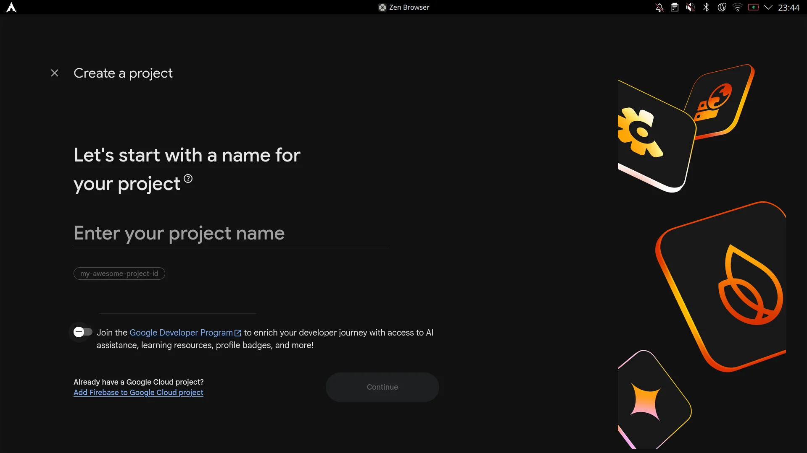<br>
  <em>1. 输入项目名称</em><br><br>
  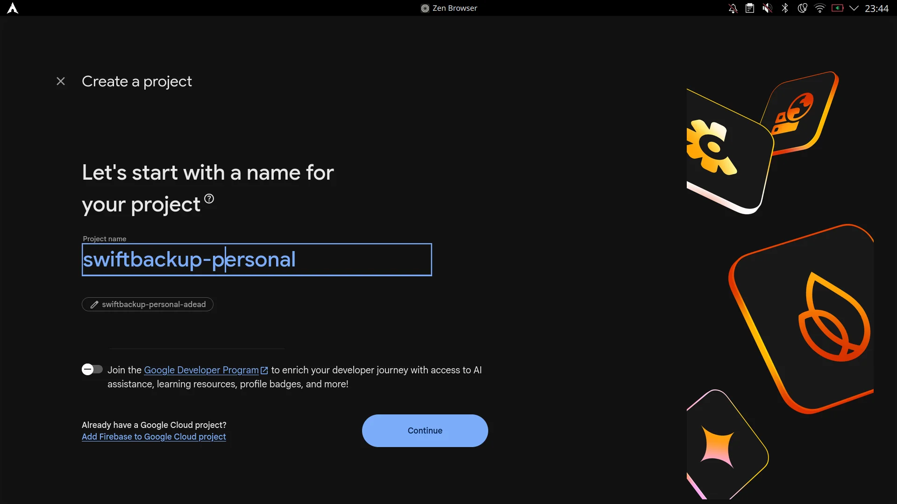<br>
  <em>2. 确认项目名称</em><br><br>
  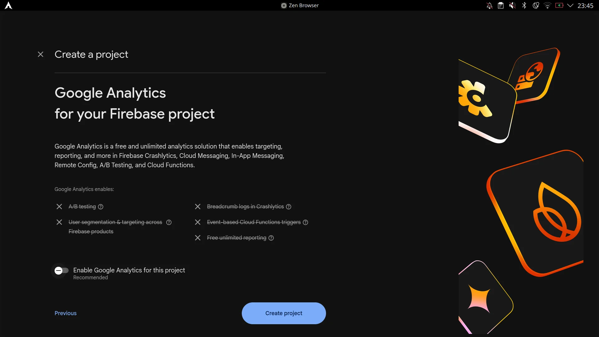<br>
  <em>3. 配置 Analytics 并点击创建项目</em><br><br>
  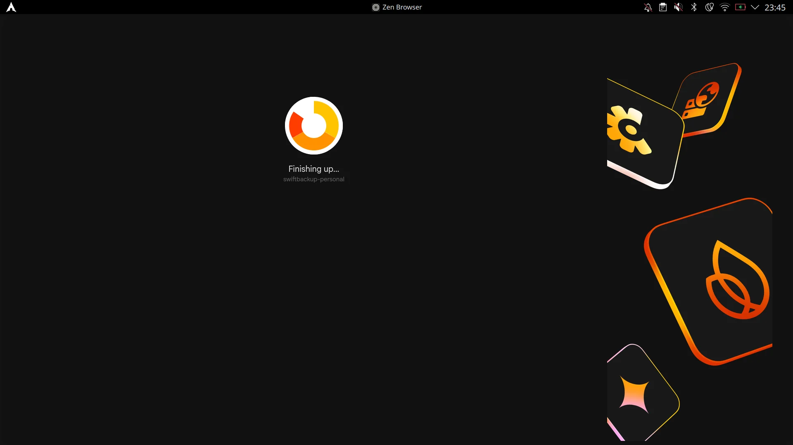<br>
  <em>4. 正在调配 Firebase 项目</em><br><br>
  <br>
  <em>5. 项目已就绪</em>
</p>
</details>

---

### 第 2 步：配置实时数据库与安全规则

1. 在 Firebase 项目侧边栏中，进入 **数据库与存储 > 实时数据库（Realtime Database）**。
2. 点击 **创建数据库**，选择离你较近的区域（如 `United States` 或 `Belgium`），并选择 **以锁定模式启动**。
3. 创建完成后，切换到顶部的 **规则** 标签。
4. 将现有规则替换为以下用户隔离安全规则：

```json
{
  "rules": {
    "users": {
      "$uid": {
        ".read": "$uid === auth.uid",
        ".write": "$uid === auth.uid"
      }
    }
  }
}
```

5. 点击 **发布** 保存规则。
6. 从 _数据_ 标签复制你的 **实时数据库 URL**（例如 `https://your-project-id-default-rtdb.firebaseio.com/`）。

<details>
<summary>查看第 2 步截图</summary>
<br>
<p align="center">
  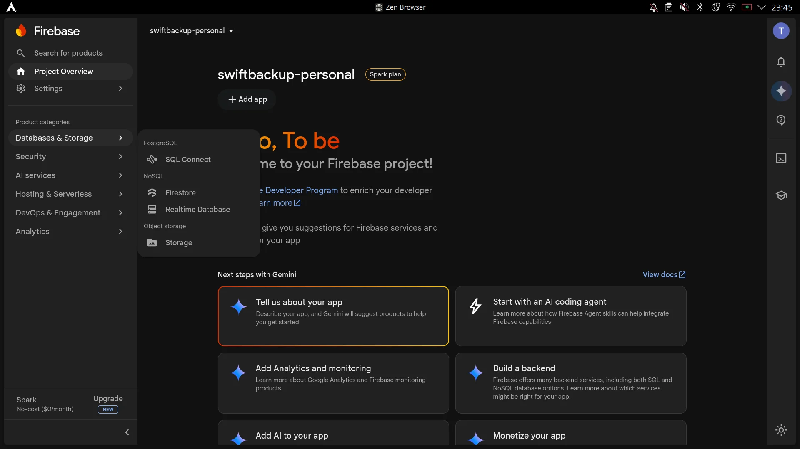<br>
  <em>1. 选择数据库与存储 &gt; 实时数据库</em><br><br>
  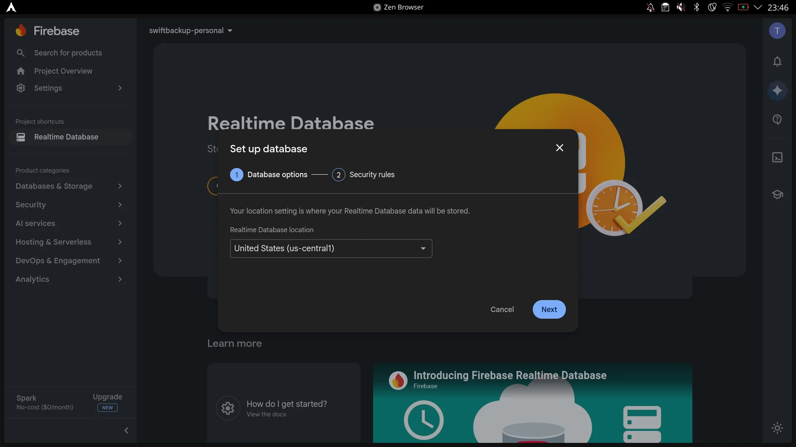<br>
  <em>2. 选择数据库区域 / 位置</em><br><br>
  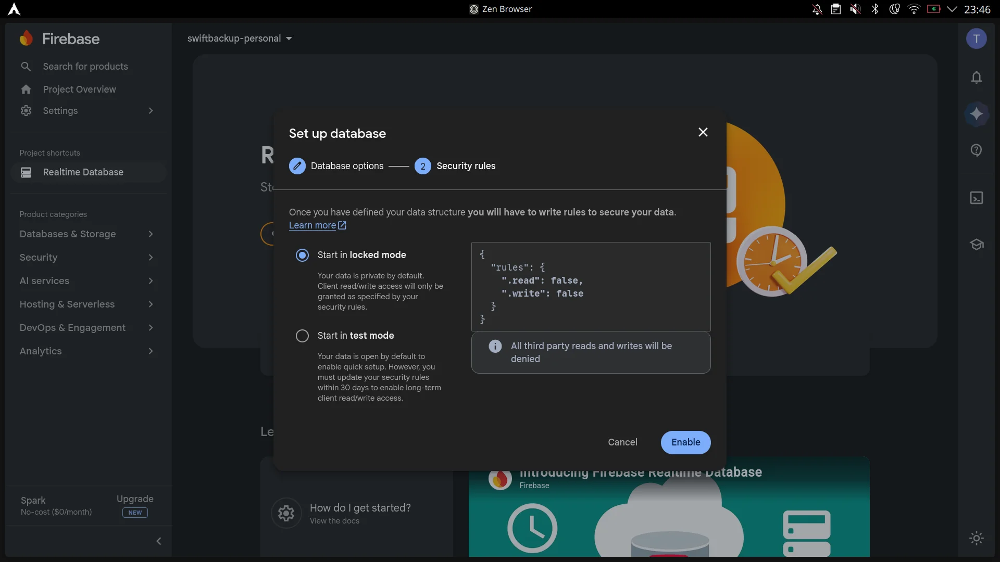<br>
  <em>3. 选择「以锁定模式启动」并启用</em><br><br>
  <br>
  <em>4. 切换到「规则」标签</em><br><br>
  <br>
  <em>5. 替换规则并点击发布</em><br><br>
  <br>
  <em>6. 安全规则发布成功</em><br><br>
  <br>
  <em>7. 从「数据」标签复制实时数据库 URL</em>
</p>
</details>

---

### 第 3 步：配置身份认证

1. 在 Firebase 侧边栏中，进入 **安全 > 身份认证（Authentication）**。
2. 选择 **登录方法** 标签。
3. 在 _其他提供商_ 下，选择 **Google**。
4. 打开 **启用**，填写你希望的 **项目公开名称**，选择 **项目支持邮箱**，然后点击 **保存**。

<details>
<summary>查看第 3 步截图</summary>
<br>
<p align="center">
  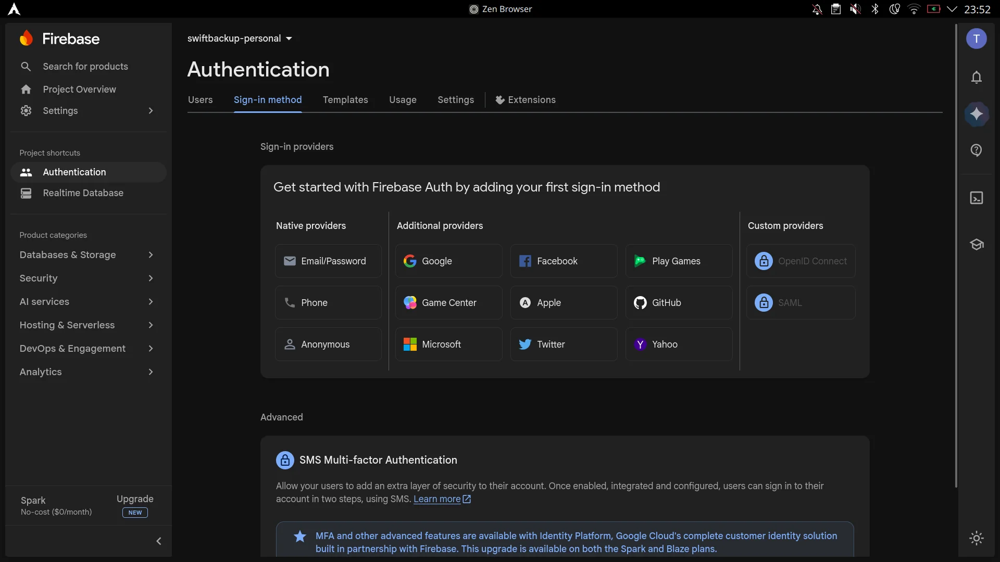<br>
  <em>1. 进入身份认证 &gt; 登录方法并选择 Google</em><br><br>
  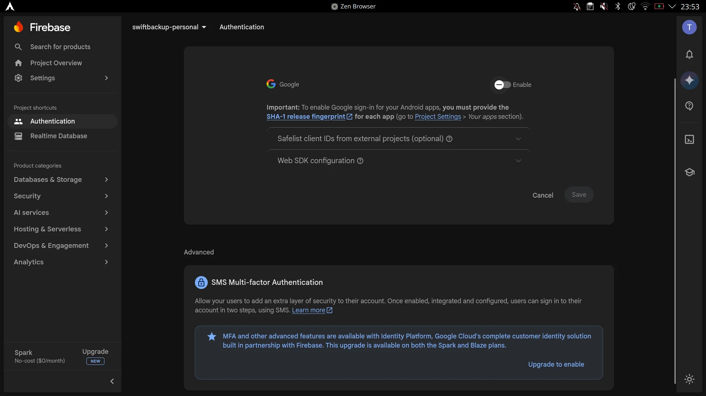<br>
  <em>2. Google 登录提供商配置对话框</em><br><br>
  <br>
  <em>3. 打开启用，填写公开名称与支持邮箱，然后保存</em><br><br>
  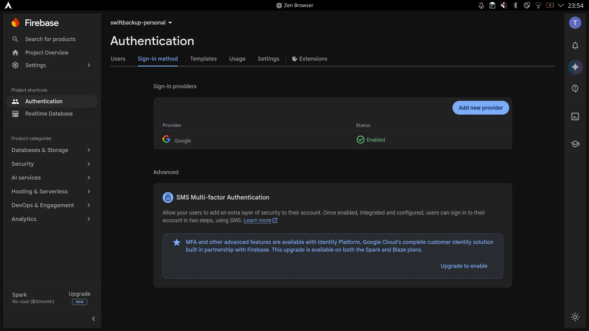<br>
  <em>4. Google 提供商启用成功</em>
</p>
</details>

---

### 第 4 步：注册 Android 应用与 OAuth 客户端

#### 1. 在 Firebase 控制台注册 Android 应用

1. 在 Firebase 控制台，从侧边栏进入 **项目概览** 页面。
2. 在「选择平台以开始使用」下，点击 **Android** 图标（添加应用）。
3. 填写包信息：
   - **Android 软件包名称**：`org.swiftapps.swiftbackup` _（或在 SwiftBackupPrem 自定义 Firebase 设置界面点击「复制包名」）_
   - **应用昵称**：`SwiftBackupPersonal` _（或任意你喜欢的名称）_
4. 点击 **注册应用**。
5. 点击 **下载 google-services.json** 保存配置文件。
6. 点击 **下一步** 跳过其余设置步骤，然后点击 **继续前往控制台**。
7. 在项目概览页，点击刚注册的应用卡片，选择 **齿轮图标（项目设置）**。
8. 滚动到 **你的应用** 部分，点击 **添加指纹**，粘贴你的 **SHA-1 指纹** _（在模块的自定义 Firebase 设置界面点击「复制指纹」）_，然后点击 **保存**。
9. _（可选）_ 在项目设置中点击 **数据隐私** 标签，取消勾选 **Firebase 服务数据共享**。

<details>
<summary>查看 Firebase 应用注册截图</summary>
<br>
<p align="center">
  <br>
  <em>1. 在项目概览点击 Android 平台图标</em><br><br>
  <br>
  <em>2. 输入包名 org.swiftapps.swiftbackup 和昵称</em><br><br>
  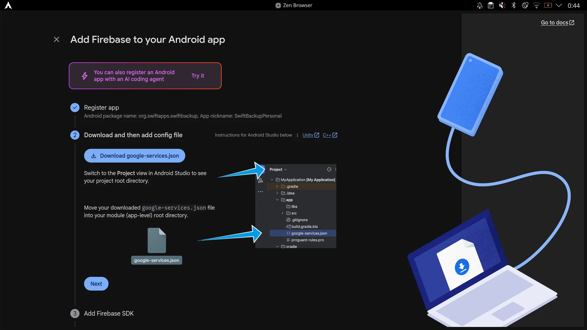<br>
  <em>3. 下载 google-services.json 配置文件</em><br><br>
  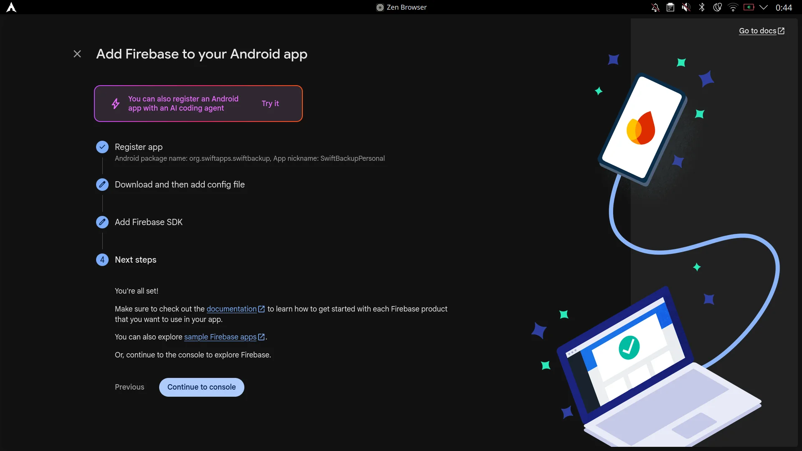<br>
  <em>4. 跳过 SDK 设置并继续前往控制台</em><br><br>
  <br>
  <em>5. 应用已注册到项目概览</em><br><br>
  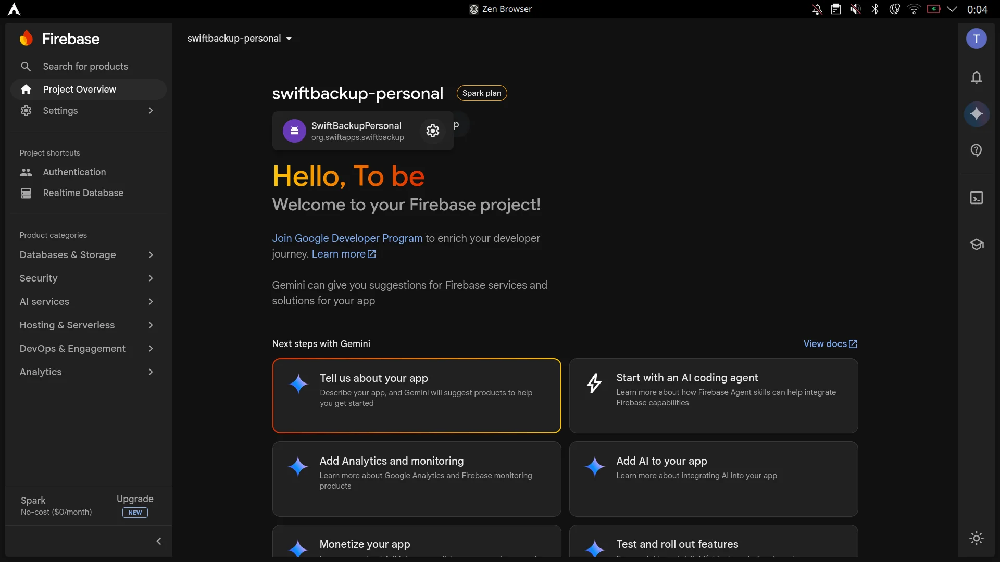<br>
  <em>6. 点击齿轮图标打开项目设置</em><br><br>
  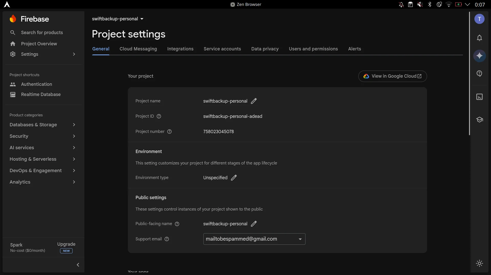<br>
  <em>7. 项目设置概览（在 Google Cloud 中查看）</em><br><br>
  <br>
  <em>8. 在「你的应用」下添加 SHA-1 指纹</em><br><br>
  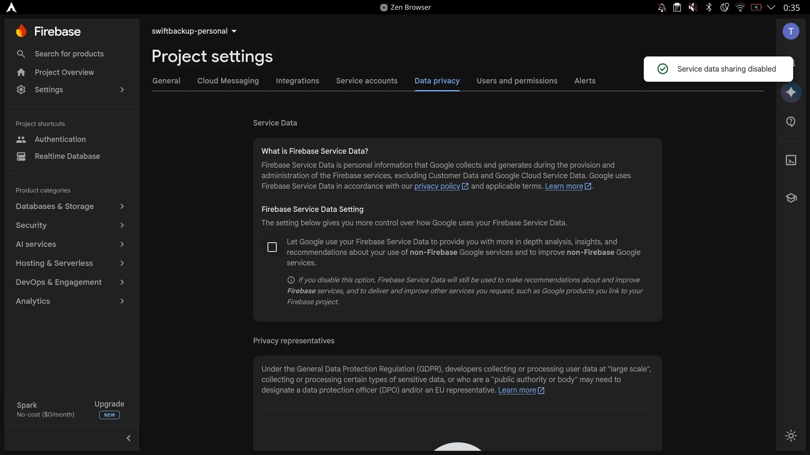<br>
  <em>9. 可选：关闭 Firebase 服务数据共享</em>
</p>
</details>

#### 2. 在 Google Cloud 控制台配置 OAuth 2.0 客户端

1. 打开 [Google Cloud API 凭据控制台](https://console.cloud.google.com/apis/credentials)（或在 Firebase 项目设置页点击 **在 Google Cloud 中查看**）。
2. 确保顶部项目下拉框已选择你的 Firebase / Google Cloud 项目。
3. 在侧边栏中，进入 **API 与服务 > 凭据**。
4. 在 **OAuth 2.0 客户端 ID** 下，编辑自动生成的 **Android client for org.swiftapps.swiftbackup**。
5. 在 **高级设置** 下，勾选 **启用自定义 URI scheme**（在确认弹窗中点击 **是**）。
6. 点击 **保存**。
7. 复制生成的 **客户端 ID** 字符串（例如 `xxxxxxxxxxxx-xxxxxxxxxxxxxxxx.apps.googleusercontent.com`）。

<details>
<summary>查看 Google Cloud OAuth 客户端截图</summary>
<br>
<p align="center">
  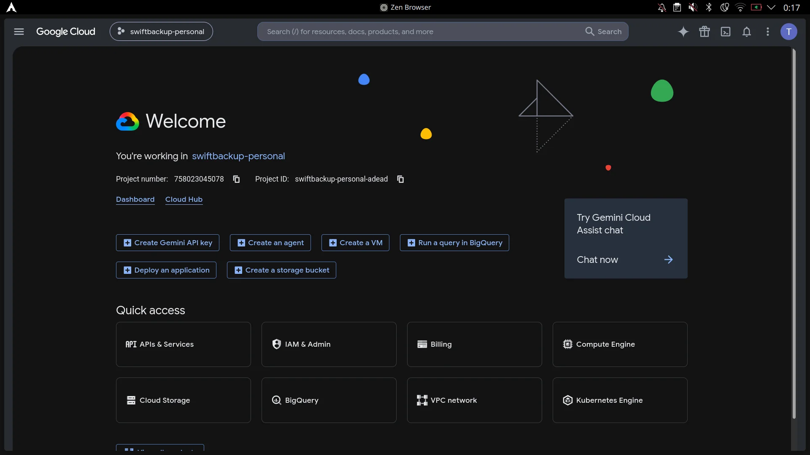<br>
  <em>1. Google Cloud 控制台仪表盘</em><br><br>
  <br>
  <em>2. 进入 API 与服务 &gt; 凭据</em><br><br>
  <br>
  <em>3. 在 OAuth 2.0 客户端 ID 下编辑自动生成的 Android 客户端</em><br><br>
  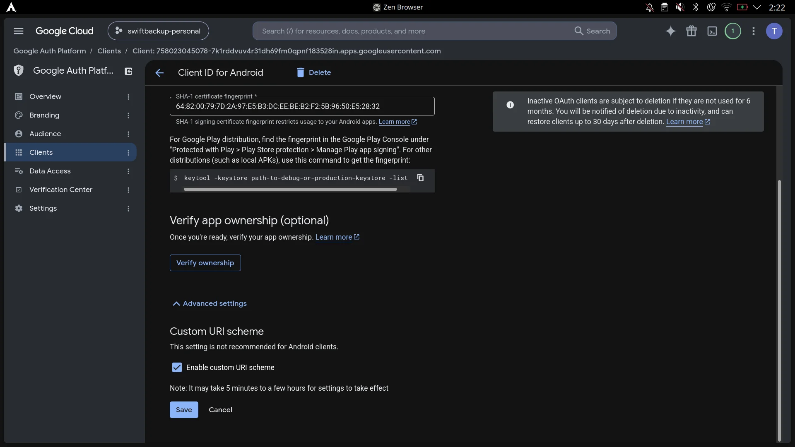<br>
  <em>4. 在高级设置中启用自定义 URI scheme</em><br><br>
  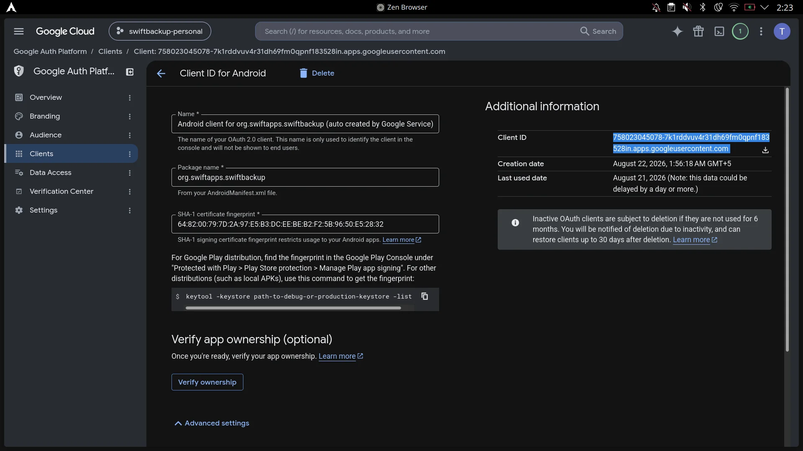<br>
  <em>5. 复制生成的 OAuth 客户端 ID</em>
</p>
</details>

---

### 第 5 步：启用 Google Drive API 与 OAuth 权限

如果你计划使用 Google Drive 进行云备份：

#### 1. 启用 Google Drive API

1. 访问 [Google Cloud Drive API 控制台](https://console.cloud.google.com/apis/library/drive.googleapis.com)。
2. 在顶部选择你的 Firebase / Google Cloud 项目。
3. 点击 **启用**，允许 Swift Backup 通过你的项目与 Google Drive 交互。

#### 2. 添加 Google Drive OAuth 权限范围

1. 打开 [Google Cloud OAuth 权限控制台](https://console.cloud.google.com/auth/scopes)。
2. 确保顶部已选择你的项目。
3. 进入 **数据访问** > 点击 **添加或移除权限范围**。
4. 在筛选框中搜索并启用：
   ```
   https://www.googleapis.com/auth/drive.file
   ```
   _（这提供安全的按文件访问权限，仅限 Swift Backup 创建或打开的文件，无需广泛的 Drive 权限。）_
5. 点击 **更新**，然后点击 **保存**（或 **保存并继续**）。

---

### 第 6 步：在 SwiftBackupPrem 中导入或填写凭据

1. 在设备上打开 **SwiftBackupPrem**。
2. 启用 **自定义 Firebase 应用**。
3. 选择以下任一方式：
   - **方式 A（自动）**：点击 **导入 google-services.json**，选择已下载的 JSON 文件。然后将 **OAuth 客户端 ID** 粘贴到客户端 ID 字段。
   - **方式 B（手动向导）**：按照应用内引导设置，检查并确认所有字段。
4. 点击 **完成并保存**。
5. 点击底部的 **强行停止** 结束正在运行的 Swift Backup 实例，然后点击 **打开应用**。
6. 使用你的 Google 账号登录 Swift Backup。

> [!NOTE]
> **Firebase Cloud Storage 可选（Spark 套餐可跳过）**
>
> Firebase Cloud Storage 现在需要付费的 **Blaze 套餐**（关联 Cloud Billing 账号）。**你可以安全地跳过在 Firebase 控制台启用 Cloud Storage。**
> Swift Backup **不会**将备份文件（APK、应用数据、通话记录）存储在 Firebase Storage 中。Firebase 仅用于身份认证和元数据同步。实际备份存储在你配置的云服务商（Google Drive、WebDAV、Nextcloud、SMB 等）或本地存储中。

---

## 从默认 Firebase 迁移并访问备份

安装使用默认 Firebase 的 Swift Backup 并登录后，可从以下路径提取你的 UID：

`/data/data/org.swiftapps.swiftbackup/shared_prefs/com.google.firebase.auth.api.Store.*.xml`

```bash
su -c 'grep -o "GET_TOKEN_RESPONSE\.[^\"]*" /data/data/org.swiftapps.swiftbackup/shared_prefs/com.google.firebase.auth.api.Store.*.xml | cut -d. -f2'
```

> [!IMPORTANT]
> 如果你的账号已被 SwiftBackup 开发者封禁，并且你在封禁后卸载了应用，则无法再获取 UID——`/data/data/org.swiftapps.swiftbackup/shared_prefs/` 目录会被删除，所有云备份将无法解密并因此丢失。
> 这是获取 UID 的唯一途径，请在安全保存 UID 之前不要卸载应用。

### 用备份验证 UID（可选）

Swift Backup 会对你的 Firebase UID 取 MD5 哈希，并使用前 16 个字符作为文件夹名：

```bash
echo -n "example uid" | md5sum | cut -c 1-16
```

**输出**：`example16char` → `/sdcard/SwiftBackup/accounts/example16char/`  
云文件夹则为：`Swift Backup (example16char)`

---

### 在自定义 Firebase 项目中创建具有此 UID 的用户

1. 使用你喜欢的包管理器安装 Firebase 工具（例如通过 Node.js）：

   ```bash
   npm install -g firebase-tools
   ```

2. 运行 `firebase login` 连接你的账号：

   ```bash
   firebase login
   ```

3. 创建 `users.json` 文件：

   ```json
   {
     "users": [
       {
         "localId": "example uid",
         "email": "examplemail@gmail.com",
         "emailVerified": true,
         "displayName": "examplename"
       }
     ]
   }
   ```

4. 查看你的项目 ID：

   ```bash
   firebase projects:list
   ```

5. 运行导入命令：

   ```bash
   firebase auth:import users.json --project exampleprojectID
   ```

6. 在 Swift Backup 中重新登录。

---

## 备份迁移中心

SwiftBackupPrem 内置强大的 **备份迁移中心**（在主屏幕的 **备份迁移** 卡片上点击 **打开迁移工具** 即可访问）。

该中心通过两个专用标签页弥合不同 Firebase 环境与云存储配置之间的差距：

1. **本地迁移**：设备端加密与元数据重建工具，可在不同 Firebase UID、匿名密钥或未加密便携格式之间解密、转换并重新加密现有备份文件夹。
2. **云端扫描与注入**：运行时 Hook 与扫描引擎，可跨多种云服务商（Google Drive、OneDrive、Dropbox、Box、pCloud、S3、WebDAV / Nextcloud）发现备份，并直接注入 Swift Backup 的恢复界面，无需事先的数据库记录。

---

### 本地迁移（解密与重新加密）

Swift Backup 使用 Facebook Conceal（AES-256-GCM + Zstandard 压缩），以用户当前的 Firebase UID 为密钥加密应用数据（`.dat`、`.extdat`、`.med`）、系统载荷和目录归档（`folder-base.fld`）。如果你切换到自定义 Firebase 后端、创建新账号，或在官方后端封禁后恢复备份，加密密钥会改变——旧备份将无法被新账号读取。

**本地迁移**完全在设备端解决这一问题，无需联网或 Root Shell 命令。它会递归检查备份文件夹，使用源密钥解密归档，重建缺失元数据，并按你选择的目标格式重新加密或提取数据。

#### 四步迁移流程

1. **第 1 步：源文件夹**
   - 输入现有备份目录路径，或点击文件夹图标通过系统文档树选择器选择（例如 `/sdcard/Download/SwiftBackup` 或 `/sdcard/SwiftBackup/accounts/<oldHash>/`）。
   - 引擎会递归遍历目录树（最深 20 层），识别所有应用备份目录（包含 `.app`、`.apk`、`.dat`、`.splits`、`.extdat`、`.med`、`.xml` 或 `.extra`）和文件夹备份（以 `Folder-` 开头或包含 `folder-base.*` / `metadata.json`）。

2. **第 2 步：解密密钥（源 UID）**
   - 输入或粘贴最初加密备份时使用的 Firebase UID。
   - **密钥预设与检测到的 UID**：点击刷新图标，可自动检测在 Swift Backup 本地配置、缓存令牌（`.sbp_auth_state`）或偏好设置中找到的候选 Firebase UID。
   - **共享匿名密钥**：如果从匿名离线备份迁移，点击 **共享匿名密钥** 芯片可填入内置匿名密钥（`d58b0944415a4889d7f11aa95fbeca50`）。

3. **第 3 步：目标加密模式**  
   选择迁移后备份的打包方式：
   - **共享匿名密钥（推荐）**：使用 Swift Backup 的静态匿名密钥重新加密归档。输出存储在账号哈希 `8690a48a4fcc72f1` 下，可在 Swift Backup 中**离线恢复，无需登录任何 Firebase 账号**。
   - **自定义 Firebase UID**：专门为你的自定义 Firebase 项目 UID 重新加密归档。适合希望备份与已登录 Google 账号关联的场景。
   - **未加密备份**：从数据切片（`.dat`、`.extdat`、`.med`、`folder-base.fld`）中完全移除 AES-256-GCM Conceal 加密，保留 Swift Backup 目录结构并生成明文 `.xml` 元数据。
     - **便携格式复选框**：在未加密模式下，勾选 **转换为标准便携格式（.apk、.tar.gz、.json）**，可将标准独立文件提取到 `ExtractedBackups/`：
       - `.app` / `.apk` → `<packageName>.apk`
       - `.splits` → `<packageName>_splits.tar`
       - `.dat` → `<packageName>_data.tar`
       - `.extdat` → `<packageName>_external_data.tar`
       - `.med` → `<packageName>_media.tar`
       - `.extra` → `<packageName>_extras.json`
       - `.xml` → `<packageName>_metadata.json`
       - `.cls` → `<packageName>_call_logs.json`
       - `.msg` → `<packageName>_sms_messages.json`
       - `.wfi` → `<packageName>_wifi.json`
       - `.wal` → `<packageName>_wallpaper.png`
       - `folder-base.fld` → `<folderName>.tar`
       - `folder-base.flm` → `<folderName>_manifest.json`

4. **第 4 步：目标文件夹并开始迁移**
   - 输入输出目录（默认为 `/storage/emulated/0/SwiftBackup`）。
   - 引擎会按 Swift Backup 的标准层级组织文件：
     - `SwiftBackup/accounts/<accountHash>/backups/apps/local/<packageName>/<backupId>/`
     - `SwiftBackup/accounts/<accountHash>/backups/folders/local/<folderName>/`
   - 点击 **开始迁移**。界面会显示实时进度（项目计数、百分比进度条和当前包名），以及实时执行日志。
   - **元数据重建**：如果原始 `.xml` 元数据缺失，引擎会自动从 APK manifest 提取元数据（`versionCode`、`versionName`、应用标签），并解密 `.extra` 载荷以获取 SSAID、权限状态和通知策略设置。

> [!NOTE]
> **存储权限说明**  
> 在 Android 11+（API 30+）上，应用需要 **管理外部存储（所有文件访问权限）** 才能跨存储卷扫描和写入备份文件夹。如遇提示，请在系统设置中授予权限。

---

### 云端扫描与注入

Swift Backup 通常严格依赖 Firebase 实时数据库（RTDB）记录来发现和列出云备份。如果缺少 RTDB 记录（例如使用自定义 Firebase 后端、账号封禁后恢复，或跨设备恢复），即使文件确实存在于云盘中，Swift Backup 也无法看到这些备份。

**云端扫描与注入**套件完全绕过了这一限制。它运行在 Xposed Hook 层，主动扫描已配置的云存储远程端，即时提取元数据，并将合成快照注入 Swift Backup 的运行时内存。

> [!IMPORTANT]
> 所有云端扫描与同步功能都需要在 SwiftBackupPrem 设置中启用 **自定义 Firebase 应用**。

#### 1. Google Drive 完整 OAuth 权限扩展

- **Swift Backup 默认行为**：请求受限的 `https://www.googleapis.com/auth/drive.file` 范围，将文件可见性严格限制为当前应用会话创建的文件。
- **扩展权限**：启用 **Google Drive 完整 OAuth 权限** 后，模块会在登录过程中动态拦截 OAuth 请求构建器、URI 构建器和认证 Intent，将请求范围升级为：
  ```
  https://www.googleapis.com/auth/drive
  ```
- **结果**：使 Swift Backup 能够查询并恢复来自不同设备、历史 ROM 或先前账号上传的备份。

> [!WARNING]
> **「Google 尚未验证此应用」提示**：  
> 由于 `https://www.googleapis.com/auth/drive` 被归类为敏感权限范围，Google Cloud 会在 Google 登录时显示未验证应用警告。点击 **高级 > 前往 Swift Backup（不安全）** 继续。这是个人开发者项目的标准行为。

#### 2. 通用云端扫描

打开 **通用云端扫描** 后，SwiftBackupPrem 会在 Swift Backup 支持的所有已连接远程存储服务商上部署原生云扫描器：

| 服务商 | 扫描器详情与能力 |
| :--- | :--- |
| **Google Drive** | 扫描 Swift Backup 根目录，解析文件 ID，并通过 Google Drive API v3 解析嵌套应用目录。 |
| **Microsoft OneDrive** | 限制在已验证的 Swift Backup 根文件夹内扫描，编码相对路径，并通过 HTTP 范围下载处理 Graph API 批量分页。 |
| **Dropbox** | 查询 Dropbox API v2 端点以映射应用和文件夹备份层级。 |
| **Box** | 使用 Box REST API v2 遍历 Box 存储树。 |
| **pCloud** | 通过 pCloud REST API 检查云归档和目录树。 |
| **Amazon S3 / S3 兼容** | 使用 AWS S3 API 扫描存储桶（支持 MinIO、Wasabi、Backblaze B2、Ceph 等）。 |
| **WebDAV / Nextcloud / ownCloud** | 使用 WebDAV XML `PROPFIND` 查询遍历远程目录并发现备份切片。 |

##### 支持的云端组件：

- **应用**：APK（`.app`/`.apk`）、分体 APK（`.splits`）、应用数据（`.dat`）、外部数据（`.extdat`）、媒体（`.med`）和元数据（`.extra`）。
- **文件夹**：自定义文件夹归档（`.fld`、`.flm`、`metadata.json`）。
- **系统数据**：通话记录（`.cls`）、短信（`.msg`）、壁纸（`.wal`、`.wal.png`）和 Wi-Fi 配置（`.wfi`）。

##### 通过 HTTP Range 请求远程解析 APK Manifest：

为了在不通过移动数据下载数 GB APK 的情况下显示准确的应用标题、包名和版本号，发现引擎内置了 `ApkRangeManifestParser`。它执行 HTTP Range 请求，仅获取 ZIP 中央目录，并在数秒内远程解析 `AndroidManifest.xml`。

#### 3. 实时数据库快照注入

模块包含内存中的 **Firebase 快照合成器**（`FirebaseSnapshotSynthesizer`）：

- Hook 到 Swift Backup 内部的 Firebase 查询和 DataSnapshot 处理器（`AppCloudBackups.fromSnapshot`、单应用详情监听器、批量云恢复加载器、应用筛选助手、云同步标签页和文件夹加载器）。
- 合成与原生 RTDB 条目格式完全一致的实时 `DataSnapshot` 对象，位于 `cloud_v1` 层级下。
- **结果**：发现的云备份会立即出现在：
  - **单应用详情**（包含所有可恢复部分：APK、数据、外部数据、分体）
  - **云同步标签页**（包含准确的备份时间戳和设备标签）
  - **批量恢复界面**（支持一键批量恢复）
  - **云备份标签下拉框**（按设备型号 / 标签筛选备份）

#### 4. 云端扫描缓存

发现的云备份会本地保存到：

```
/sdcard/SwiftBackup/cloud_discovered_cache.json
```

- 提供即时离线浏览，无需每次打开界面都等待网络扫描。
- 内存缓存 TTL（60 秒）防止快速切换界面时的冗余云网络请求。
- 随时在应用中点击 **清除云端缓存**，清除缓存条目并立即触发跨云服务商的全新扫描。

---

### Firebase 实时数据库元数据同步

快照注入动态提供内存中的恢复条目；你也可以使用 **同步元数据到自定义 Firebase** 功能，将发现和重建的元数据永久保存到你的私有 Firebase 实时数据库：

- **原生 `cloud_v1` 结构**：同步引擎直接写入 Swift Backup 官方 RTDB 架构：
  ```
  /users/<UID>/cloud_v1/<provider_key>/tags/<device_tag>/apps/<sanitized_pkg>/<backup_id>
  /users/<UID>/cloud_v1/<provider_key>/tags/<device_tag>/folders/<folder_id>
  ```
  _（其中 `<provider_key>` 以 `<provider> (<sanitized_email>)` 格式解析）_
- **智能去重**：写入前，同步引擎会查询你现有的 RTDB `cloud_v1` 树，跳过已存在记录，避免冗余写入。
- **令牌解析与认证**：自动从 Swift Backup 的 OAuth 会话或交换的刷新令牌解析 Firebase Auth ID 令牌，确保安全的已认证数据库写入。
- **遗留清理**：自动清除旧实现遗留的过时 `/users/<UID>/backups` 节点。
- **立即同步按钮**：在云端扫描标签页点击 **立即同步**，立即触发所有本地和云元数据记录的完整同步。

---

## 配置导出与迁移

- **导出配置**：点击右上角菜单（⋮）> **导出配置**，将当前配置保存为 JSON 文件（`sbp_config.json`）。
- **导入配置**：在新设备或全新 ROM 安装后，点击 **导入配置** 即可一键恢复设置。

---

## 从源码构建

### 前提条件

- JDK 17 或更高版本
- Android SDK，Platform 37（`compileSdk 37`）
- Android NDK（`25.1.8937393` 或更高）与 CMake `3.22.1+`

### 构建步骤

1. 克隆仓库：

   ```bash
   git clone https://github.com/YOUR_USERNAME/SwiftBackupPrem.git
   cd SwiftBackupPrem
   ```

2. 构建调试 APK：

   ```bash
   ./gradlew assembleDebug
   ```

3. 构建优化发布 APK：

   ```bash
   ./gradlew assembleRelease
   ```

构建生成的 APK 位于 `app/build/outputs/apk/release/` 目录。

你也可以通过本仓库的 **GitHub Actions** 工作流在云端自动编译（推送代码到 `main` 分支或手动触发即可）。

---

## 社区与支持

加入官方 Telegram 群组，获取讨论、支持、版本更新以及自定义 Firebase 配置帮助：

<p align="center">
  <a href="https://t.me/SwiftBackupPrem">
    
  </a>
</p>

- **群组链接**：[https://t.me/SwiftBackupPrem](https://t.me/SwiftBackupPrem)
- **获取帮助**：提问故障排查或分享设置技巧。
- **版本与 APK**：在 Telegram 内直接获取下载链接与发布通知。

---

## 常见问题（FAQ）

<details>
<summary><b>问：应用中显示「LSPosed 模块未启用」。</b></summary>
<p>请确认你已：</p>
<ol>
  <li>在 LSPosed 管理器中启用 <b>SwiftBackupPrem</b>。</li>
  <li>将 <b>Swift Backup</b>（<code>org.swiftapps.swiftbackup</code>）加入模块作用域。</li>
  <li>强行停止 Swift Backup 或重启设备。</li>
</ol>
</details>

<details>
<summary><b>问：为什么需要自定义 Firebase 项目？不用会被封号吗？</b></summary>
<p>默认情况下，Swift Backup 会向官方开发者的 Firebase 后端认证。官方服务器会执行定期许可证检查、防篡改验证和遥测检测。如果检测到未授权或修改过的应用使用，开发者可以在其 Firebase 实例上禁用/封禁你的账号，撤销你对 Swift Backup 和备份元数据的访问权限。</p>
<p>连接你自己的个人 Firebase 后端可实现 <b>100% 隔离</b>：认证和元数据保存在你的私有云中，外部服务器无法撤销你的账号。</p>
</details>

<details>
<summary><b>问：需要付费的 Firebase Blaze 套餐或 Cloud Storage 吗？</b></summary>
<p><b>不需要！</b> 100% 免费的 <b>Firebase Spark 套餐</b> 完全足够。Swift Backup 仅使用 Firebase Authentication 和 Realtime Database 处理账号身份与同步元数据。实际备份归档（APK、应用数据等）存储在你的个人云服务商（如 Google Drive、WebDAV、Nextcloud）上，而非 Firebase Storage。</p>
</details>

<details>
<summary><b>问：Google 登录失败，错误码 10 或 12500。</b></summary>
<p>这表示 OAuth 不匹配、客户端 ID 错误或 API 配置缺失：</p>
<ol>
  <li><b>检查客户端 ID 类型：</b> 在 SwiftBackupPrem 设置中，确保输入的是 <b>Android OAuth 客户端 ID</b>，而非 Web 客户端 ID。</li>
  <li><b>验证 SHA-1 指纹：</b> 使用 SwiftBackupPrem 引导设置中的 <b>复制指纹</b> 助手，确保与 Android OAuth 客户端和 Firebase Android 应用设置中添加的 SHA-1 一致。</li>
  <li><b>自定义 URI Scheme：</b> 确保在 Google Cloud 控制台 &gt; 凭据 &gt; Android OAuth 客户端中勾选了 <b>启用自定义 URI scheme</b>。</li>
  <li><b>启用 Google Drive API：</b> 确认 Google Cloud 控制台的 API 与服务下已启用 <b>Google Drive API</b>。</li>
</ol>
</details>

<details>
<summary><b>问：登录时 Google Drive 显示「Google 尚未验证此应用」。</b></summary>
<p>这是预期行为。启用 <b>Google Drive 完整访问与云恢复</b> 后，模块会请求完整的 <code>https://www.googleapis.com/auth/drive</code> 权限范围，以便 Swift Backup 发现和重建历史账号或 ROM 安装中创建的备份。</p>
<p>由于你的 Google Cloud 项目是个人且未验证的，Google 会显示标准安全提示。点击 <b>高级 &gt; 前往 Swift Backup（不安全）</b> 继续。</p>
</details>

<details>
<summary><b>问：我的账号在默认 Firebase 后端被封禁了，还能恢复旧备份吗？</b></summary>
<p><b>可以，前提是仍持有旧的 Firebase UID 密钥。</b></p>
<p>Swift Backup 使用 AES-256-GCM + Zstandard，并以你的 Firebase <code>UID</code> 作为解密密钥加密备份归档（<code>.dat</code>、<code>.extra</code>）。如果你提取了旧 UID（参见<a href="#从默认-firebase-迁移并访问备份">迁移指南</a>），并在自定义 Firebase 项目中创建具有完全相同 UID 的用户，SwiftBackupPrem 就能解密并恢复你所有的先前备份。</p>
</details>

<details>
<summary><b>问：被封禁后我卸载或清除了 Swift Backup，还能恢复旧备份吗？</b></summary>
<p>很遗憾，<b>不能</b>。当你卸载或清除 Swift Backup 数据时，包含缓存 Firebase 认证令牌的本地 <code>/data/data/org.swiftapps.swiftbackup/shared_prefs/</code> 目录会被删除。由于官方服务器已禁用你的账号，你无法登录以取回原始 UID。没有原始 UID 密钥，AES-256-GCM 加密数据无法解密。</p>
<p><i>建议：始终备份你的 Firebase UID，或将 SwiftBackupPrem 配置（<code>sbp_config.json</code>）导出到安全存储。</i></p>
</details>

<details>
<summary><b>问：如何验证提取的 UID 与备份文件夹匹配？</b></summary>
<p>对原始 UID 字符串计算 MD5 哈希（例如使用在线 MD5 工具或 <code>echo -n "YOUR_UID" | md5sum</code>）。将 MD5 哈希的<b>前 16 个十六进制字符</b>与存储或 Google Drive 上的备份文件夹名称进行比较。如果匹配，你就拥有恢复这些备份所需的确切 UID。</p>
</details>

<details>
<summary><b>问：<code>firebase auth:import</code> 失败，提示「No hash algorithm specified」或项目错误。</b></summary>
<p>确保运行 <code>firebase projects:list</code> 获取确切的 <b>项目 ID</b>（而非显示名称）。使用：</p>
<pre><code class="language-bash">firebase auth:import users.json --project YOUR_PROJECT_ID
</code></pre>
<p>或者，你也可以使用迁移指南中提供的 Firebase Admin Python SDK 脚本创建用户。</p>
</details>

<details>
<summary><b>问：云恢复时，已卸载的应用为何显示为包名（如 <code>com.whatsapp</code>）或缺少图标？</b></summary>
<p>当备份直接从云元数据索引，而应用当前未安装在设备上时，Swift Backup 会回退显示备份头中记录的包标识符。一旦在本地恢复或安装，Android 会正常解析完整显示名称和应用图标。</p>
</details>

<details>
<summary><b>问：如何访问和使用备份迁移中心？</b></summary>
<p>SwiftBackupPrem 内置 <b>备份迁移中心</b>（在主屏幕的 <b>备份迁移</b> 卡片上点击 <b>打开迁移工具</b>）：</p>
<ul>
  <li><b>本地迁移标签页：</b> 使用源 Firebase UID 解密现有备份文件夹，重建缺失元数据，支持 3 种目标加密模式（共享匿名密钥、自定义 Firebase UID，或可选便携提取的未加密备份），并重新加密或提取以供离线或新账号恢复。</li>
  <li><b>云端扫描与注入标签页：</b> 提供细粒度控制：
    <ul>
      <li><b>Google Drive 完整 OAuth 权限：</b> 动态将 OAuth 范围扩展到 <code>auth/drive</code>，以发现跨账号或历史 ROM 创建的备份。</li>
      <li><b>通用云端扫描：</b> 扫描并索引 Google Drive、OneDrive、Dropbox、Box、pCloud、S3 和 WebDAV / Nextcloud 上的备份。</li>
      <li><b>实时数据库快照注入：</b> 通过合成 DataSnapshot 将发现的云备份即时注入 Swift Backup 恢复列表。</li>
      <li><b>同步元数据到自定义 Firebase：</b> 将重建的本地和发现的云备份元数据推送到你的私有 Firebase 实时数据库（<code>cloud_v1</code> 层级）。</li>
      <li><b>云端扫描缓存：</b> 管理本地发现缓存以实现快速离线访问，并提供一键清除缓存按钮。</li>
    </ul>
  </li>
</ul>
</details>

<details>
<summary><b>问：云备份恢复支持通话记录、短信、壁纸、WiFi 网络和文件夹吗？</b></summary>
<p>支持。云端扫描和备份重建引擎会索引并恢复通话记录（<code>.cls</code>）、短信（<code>.msg</code>）、壁纸（<code>.wal</code>/<code>.wal.png</code>）、WiFi 配置（<code>.wfi</code>）和文件夹备份（<code>.fld</code>/<code>.flm</code>），以及完整应用归档（<code>.app</code>、<code>.dat</code>、<code>.splits</code>、<code>.extdat</code>、<code>.extra</code>）。如果缺失，文件夹元数据（<code>metadata.json</code>）也会自动重建。</p>
</details>

<details>
<summary><b>问：SwiftBackupPrem 可以与 Swift Backup 的分身或工作资料实例一起使用吗？</b></summary>
<p>可以。确保 LSPosed 模块作用域覆盖分身实例或次要用户资料，并验证该资料空间已正确授予 Root 访问权限和存储权限。</p>
</details>

<details>
<summary><b>问：DexKit 在此模块中如何工作？</b></summary>
<p>Swift Backup 在不同版本中使用 ProGuard/R8 混淆类。DexKit 不会硬编码在每次更新时都会失效的静态类名和签名，而是在运行时动态检查字节码结构以自动定位所需 Hook，并缓存结果以获得最佳性能。</p>
</details>

---

## 致谢

- **[Juby210](https://github.com/Juby210)** — SwiftBackupPrem 原作者。
- **[s1ddhants1](https://github.com/s1ddhants1)** — 维护者。
- **[LuckyPray/DexKit](https://github.com/LuckyPray/DexKit)** — 强大的运行时 DEX 搜索与 Hook 引擎。
- **[LSPosed](https://github.com/LSPosed/LSPosed)** — 现代 Android 的 ART Hook 框架。

---

## 许可证与免责声明

本项目采用 [MIT 许可证](LICENSE)。

**免责声明**：本项目严格用于个人、教育与备份管理目的。Swift Backup 由 SwiftApps 开发。如果你喜欢 Swift Backup，请考虑支持官方开发者。

---

### 关于本中文分支

- 界面字符串：`app/src/main/res/values-zh-rCN/strings.xml`
- 系统语言为简体中文时，应用会自动显示中文界面
- 上游项目：[s1ddhants1/SwiftBackupPrem](https://github.com/s1ddhants1/SwiftBackupPrem)
